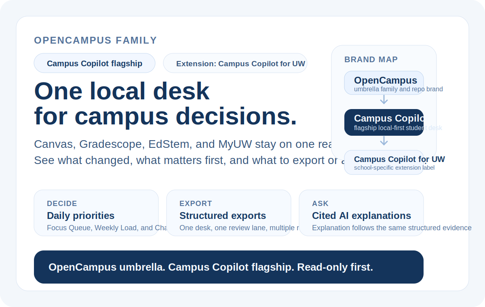

# Campus Copilot

> A local-first academic decision workspace that turns Canvas, Gradescope, EdStem, and MyUW into one structured workbench, then lets cited AI explain the result instead of scraping the web directly.

[Docs](docs/README.md) · [Launch Packet](docs/launch-packet.md) · [Examples](examples/README.md) · [Plugin Bundles](examples/integrations/plugin-bundles.md) · [Toolbox Chooser](examples/toolbox-chooser.md) · [Public Skills](skills/README.md) · [Contract Freeze](docs/11-wave1-contract-freeze-gap-matrix.md) · [Wave 4-7 Ledger](docs/12-wave4-7-omnibus-ledger.md) · [Site Depth Ledger](docs/13-site-depth-exhaustive-ledger.md) · [Public Distribution](docs/14-public-distribution-scoreboard.md) · [Publication Packet](docs/15-publication-submission-packet.md) · [Quickstart](#quickstart) · [Builder Fit](docs/10-builder-api-and-ecosystem-fit.md) · [Verification Matrix](docs/verification-matrix.md) · [Contributing](CONTRIBUTING.md) · [AI Collaboration](CLAUDE.md) · [Security](SECURITY.md) · [License](LICENSE)



## First Look In 30 Seconds

If you only want the fastest truthful proof instead of the full repo story, use this order:

| If you want to prove | Open this first | Then check | What a successful first proof looks like |
| :-- | :-- | :-- | :-- |
| the product shape is real | [`docs/storefront-assets.md`](docs/storefront-assets.md) | [`docs/assets/weekly-assignments-example.md`](docs/assets/weekly-assignments-example.md) | a real workbench screenshot plus one export sample, not a generic AI shell mock |
| what a successful output looks like | [`examples/current-view-triage-example.md`](examples/current-view-triage-example.md) | [`examples/site-overview-audit-example.md`](examples/site-overview-audit-example.md) | a plain-language current-view answer plus one site audit card, both still read-only and snapshot-backed |
| how closeout and launch are packaged | [`docs/launch-packet.md`](docs/launch-packet.md) | [`docs/release-notes-wave47-draft.md`](docs/release-notes-wave47-draft.md) | one launch-facing packet that links proof assets, release notes, release checklist, and GitHub settings-only checks without overclaiming |

If you specifically want the builder/tooling route, skip to [Builder Quick Paths](#builder-quick-paths) after this section.

## Why This Exists

Campus Copilot is not a generic sidebar chatbot.

It is a focused **academic decision workspace** for students who want one place to answer questions like:

- What assignments are still open?
- What changed recently across my classes?
- What should I pay attention to first?

The product strategy is intentionally narrow:

- **Structured data first**: adapters normalize site-specific data into one shared schema.
- **Local-first by default**: storage, workbench views, filtering, and export live locally.
- **AI after structure**: AI can summarize or explain the workbench result, but it does not read raw DOM, raw HTML, or cookies.
- **Export is a first-class feature**: Markdown, CSV, JSON, and ICS are part of the core product, not an afterthought.

Campus Copilot now includes a **learning decision layer** on top of that workbench:

- local user judgment through pin / snooze / note / dismiss overlays
- derived decision views such as Focus Queue, Weekly Load, and Change Journal
- cited AI answers that point back to structured entities instead of raw pages

## What You Can Do On Day One

If you are evaluating the repository as a real product surface, the first useful loop is simple:

1. sync the supported sites into one local workbench
2. read the decision layer to see what is open, what changed, and what should come first
3. export the current view or ask cited AI to explain the same structured result

That is the mainline. The AI/runtime and builder-facing story only matters after this student-facing loop is clear.

## Why AI And Builder Workflows Still Care

After the student-facing path is clear, the honest ecosystem fit is this:

Think of Campus Copilot as an **AI-ready context surface**, not an autonomous agent shell.

- **Category**: local-first academic decision workspace
- **AI hook**: cited AI over structured study data, plus a thin BFF for formal model calls
- **Result**: one auditable place to see what changed, what is risky, and what to do first

That makes the repository relevant to current AI/agent ecosystems in a very specific way:

- it already works with **Codex / Claude Code-style workflows** because the repo produces structured, exportable, citation-friendly outputs instead of raw browser noise
- it now exposes a small but real **read-only SDK / CLI / MCP surface plus a provider-runtime seam package** on top of the same local-first substrate
- it is **not** a generic agent runtime, hosted autonomy platform, or write-capable operator bot

## Builder Quick Paths

If you are coming from a builder/runtime workflow instead of the student-facing extension path, use the shortest honest path for your tool:

Use the [consumer onboarding matrix](#consumer-onboarding-matrix) below when you want the exact first file, first command, and boundary for a specific tool.

If you want the fastest repo-local onboarding pack instead of reading the whole repository narrative, use these in order:

1. [examples/README.md](examples/README.md)
2. [examples/toolbox-chooser.md](examples/toolbox-chooser.md)
3. [examples/integrations/README.md](examples/integrations/README.md)
4. [examples/mcp/README.md](examples/mcp/README.md) if you already know you want the site-sidecar route
5. [skills/README.md](skills/README.md)
6. the package READMEs under `packages/*/README.md` for the exact surface you want to consume
7. [examples/integrations/plugin-bundles.md](examples/integrations/plugin-bundles.md) if you want the current Codex / Claude / OpenClaw plugin-grade repo bundle router

The important guardrail is simple:

> Campus Copilot can be a strong read-only context surface for these tools.  
> It is still **not** a live-browser plugin, a write-capable MCP platform, or a hosted autonomy layer.

## Consumer Onboarding Matrix

If you just want the fastest truthful starting point, use this routing table instead of guessing:

| Consumer | Start here | Best when you want | Keep this boundary |
| :-- | :-- | :-- | :-- |
| Codex | [`examples/integrations/codex-mcp.example.json`](examples/integrations/codex-mcp.example.json) | one generic stdio MCP server over the local BFF plus imported snapshots when repo-root launch or `cwd` support is available | read-only, local-first, not browser control |
| Codex without `cwd` support | [`examples/integrations/codex-mcp-shell.example.json`](examples/integrations/codex-mcp-shell.example.json) | the same generic MCP server, but with an explicit repo-root shell wrapper | still local-first and read-only |
| Claude Code / Claude Desktop | [`examples/integrations/claude-code-mcp.example.json`](examples/integrations/claude-code-mcp.example.json) and [`examples/mcp/claude-desktop.example.json`](examples/mcp/claude-desktop.example.json) | the same read-only MCP path, either generic or site-scoped | snapshot-first or thin-BFF-first, never write-capable |
| Claude Code without `cwd` support | [`examples/integrations/claude-code-mcp-shell.example.json`](examples/integrations/claude-code-mcp-shell.example.json) | the same generic MCP path, but with an explicit repo-root shell wrapper | still local-first and read-only |
| OpenClaw-style local runtimes | [`examples/openclaw-readonly.md`](examples/openclaw-readonly.md) | a local operator/runtime that can launch stdio MCP tools but should keep Campus Copilot as a context provider | use command snippets directly unless your runtime explicitly supports the same `mcpServers` shape |
| CLI-first builder checks | [`examples/cli-usage.md`](examples/cli-usage.md) | quick status, provider readiness, per-site inspection, or export from a terminal | local BFF or snapshot only |
| SDK-first builder code | [`examples/sdk-usage.ts`](examples/sdk-usage.ts) | embedding the read-side contract in your own scripts or tools | shared schema/snapshot/BFF substrate only |

For deterministic first-run examples, prefer [`examples/workspace-snapshot.sample.json`](examples/workspace-snapshot.sample.json) before you involve any live browser state.

If you want the same routing in a narrower builder-only form, use [`examples/README.md`](examples/README.md) for config files and [`skills/README.md`](skills/README.md) for prompt/skill entrypoints.

If you are already sure you want a builder-facing surface but do not know whether to choose MCP, a site sidecar, CLI, `workspace-sdk`, or `site-sdk`, start with [`examples/toolbox-chooser.md`](examples/toolbox-chooser.md).

If your workflow is specifically an OpenClaw-style local runtime and you want the most direct prompt-first path, start with [`skills/openclaw-readonly-consumer/SKILL.md`](skills/openclaw-readonly-consumer/SKILL.md).

## Public Proof Path

If you want the shortest "prove this repo is real" path instead of reading everything:

1. look at the public-facing workbench proof asset in [`docs/storefront-assets.md`](docs/storefront-assets.md)
2. open the consumer router in [`examples/README.md`](examples/README.md)
3. open the matching public skill router in [`skills/README.md`](skills/README.md)
4. read the machine-readable and builder-facing contract summary in [`docs/10-builder-api-and-ecosystem-fit.md`](docs/10-builder-api-and-ecosystem-fit.md)
5. run `pnpm proof:public` for the fresh repo-local builder/package proof loop

That five-step path is the GitHub-first proof trail for students, builders, and coding-agent consumers.

If you need the exact bundle-grade vs registry-blocked ledger before you publish or pitch anything, open [`docs/14-public-distribution-scoreboard.md`](docs/14-public-distribution-scoreboard.md) right after the proof loop.

If you want the shortest plain-language proof of the consumer-facing helper layer, add these two checks immediately after step 3:

- [`examples/current-view-triage-example.md`](examples/current-view-triage-example.md)
- [`examples/site-overview-audit-example.md`](examples/site-overview-audit-example.md)
- [`scripts/proof-public-surface.sh`](scripts/proof-public-surface.sh) if you want the shell-level wrapper behind `pnpm proof:public`

## Current Product Shape

Today the repository already includes:

- A multi-site extension runtime for `Canvas`, `Gradescope`, `EdStem`, and `MyUW`
- A local canonical data layer backed by shared schema + Dexie read models
- A learning decision layer with local overlay, Focus Queue, Weekly Load, and Change Journal
- Wave 2 read-only depth for assignment submission context, discussion highlights, and class/exam location context on the same entity contract
- A workbench surface for sidepanel / popup / options
- A standalone read-only Web workbench that imports the same current-view workspace contract into the same storage/read-model pipeline
- Export presets for current view, weekly assignments, recent updates, deadlines, focus queue, weekly load, and change journal
- A shared AI consumer seam for `OpenAI`, `Gemini`, and a local `Switchyard` runtime on the same semantic contract
- Cited AI responses over structured workbench outputs
- A repo-public read-only builder toolbox preview:
  - `@campus-copilot/sdk` entrypoints for `api`, `snapshot`, and `sites`
  - `@campus-copilot/workspace-sdk` for derived workbench state, export artifacts, and AI-ready snapshot context
  - `@campus-copilot/site-sdk` for per-site overview helpers on the imported snapshot contract
  - `@campus-copilot/cli` for snapshot summaries, per-site inspection, provider status, and BFF chat
  - `@campus-copilot/mcp` for snapshot-backed MCP config helpers
  - `@campus-copilot/mcp-server` for the combined read-only stdio MCP server
  - `@campus-copilot/mcp-readonly` for site-scoped read-only MCP sidecars
  - `@campus-copilot/provider-runtime` for the Campus-to-provider seam and optional local Switchyard bridge contract
  - repo-local public skills and Codex integration examples
- Deterministic repository verification through `pnpm verify`

## Current Scope vs Next Phase

The easiest way to keep the repo honest is to separate three layers instead of mixing them into one big promise:

- **Current formal scope**: the four-site workbench, shared schema/read-model truth, Wave 2 read-only depth already normalized into assignment/message/event/resource detail, extension + standalone web workbench surfaces, export, cited AI, the shared BFF seam for `OpenAI` / `Gemini` / `Switchyard`, and the repo-public read-only SDK / CLI / MCP surfaces plus a public-ready repo-local provider-runtime seam package over imported snapshots and the thin BFF
- **Next-phase engineering**: product-serving depth that still strengthens the same workbench, such as selective `Canvas` reply / attachment expansion, richer `Gradescope` page / image rendering beyond the current annotation summaries, broader `EdStem` grouped-material or richer download UX paths, and selective `registration / tuition / textbook` promotion on the same contract
- **Current internal direction**: browser control-plane diagnostics stay internal, and Wave 5 now means `Switchyard-first` compat/cutover without giving away Campus-owned answer semantics or student-facing stop-rule logic
- **Later ambition**: broader publication, release-channel distribution, and launch-facing `SEO / video` work

Use [docs/11-wave1-contract-freeze-gap-matrix.md](docs/11-wave1-contract-freeze-gap-matrix.md), [docs/12-wave4-7-omnibus-ledger.md](docs/12-wave4-7-omnibus-ledger.md), and [docs/13-site-depth-exhaustive-ledger.md](docs/13-site-depth-exhaustive-ledger.md) as the canonical matrices for that split.

## Builder-Facing Surface

Today the builder-facing surface is still intentionally narrow, but it is no longer just “future direction”:

- **Current API layer**: a thin local BFF in `apps/api` for formal `OpenAI` / `Gemini` API-key calls plus the shared local `Switchyard` bridge
- **Current machine-readable contract**: [`docs/api/openapi.yaml`](docs/api/openapi.yaml) for the thin local HTTP edge that exists today
- **Current shared substrate**: normalized schema, derived storage read models, and export-ready structured outputs
- **Current internal runtime seam**: [`packages/provider-runtime/src/index.ts`](packages/provider-runtime/src/index.ts)
- **Current provider-runtime seam package**: [`packages/provider-runtime/README.md`](packages/provider-runtime/README.md)
- **Current SDK surface**: [`packages/sdk/src/index.ts`](packages/sdk/src/index.ts) with read-only BFF + snapshot helpers
- **Current CLI surface**: [`packages/cli/bin/campus-copilot.mjs`](packages/cli/bin/campus-copilot.mjs) for snapshot summaries, per-site inspection, provider status, and BFF chat
- **Current MCP config surface**: [`packages/mcp/src/index.mjs`](packages/mcp/src/index.mjs) for snapshot-backed config helpers and site-sidecar wiring
- **Current MCP server surface**: [`packages/mcp-server/src/bin.ts`](packages/mcp-server/src/bin.ts) for the combined read-only stdio server
- **Current site MCP sidecars**: [`packages/mcp-readonly/src/server.mjs`](packages/mcp-readonly/src/server.mjs) with four site-scoped read-only entrypoints over imported snapshots
- **Current site API preview libs**:
  - [`packages/gradescope-api/src/index.ts`](packages/gradescope-api/src/index.ts)
  - [`packages/edstem-api/src/index.ts`](packages/edstem-api/src/index.ts)
  - [`packages/myuw-api/src/index.ts`](packages/myuw-api/src/index.ts)
- **Current skills/examples**:
  - [`skills/README.md`](skills/README.md)
  - [`examples/README.md`](examples/README.md)
  - [`examples/cli-usage.md`](examples/cli-usage.md)
  - [`examples/mcp-readonly.md`](examples/mcp-readonly.md)
  - [`examples/openclaw-readonly.md`](examples/openclaw-readonly.md)
  - [`examples/sdk-usage.ts`](examples/sdk-usage.ts)

If you want the builder-facing version of that story, read [docs/10-builder-api-and-ecosystem-fit.md](docs/10-builder-api-and-ecosystem-fit.md).
If you want the exact publication/blocker ledger behind those surfaces, read [docs/14-public-distribution-scoreboard.md](docs/14-public-distribution-scoreboard.md).
If you want the per-site exhaustive map and hard classification behind that story, read [docs/13-site-depth-exhaustive-ledger.md](docs/13-site-depth-exhaustive-ledger.md).

So the honest statement is:

> Campus Copilot already has a real AI/runtime spine and a real read-only builder toolbox preview, but it is **not** a hosted autonomy platform, a live-browser control product, or a write-capable MCP server.

Wave 6 is now coherent enough to consume directly from the repository without guesswork:

- package names, commands, examples, docs, and package metadata line up in-repo
- the site API preview libs and site-scoped MCPs must stay clearly read-only
- registry publication and broader distribution must not outrun the still-pending Wave 5 `Switchyard-first` cutover
- `pnpm proof:public` is the current repo-local proof loop for public packaging readiness; it does not imply official listing or marketplace publication

Public-facing evidence you can inspect in-repo:

- [Hero/storefront asset inventory](docs/storefront-assets.md)
- [Workbench screenshot inventory](docs/storefront-assets.md)
- [Sample weekly assignments export](docs/assets/weekly-assignments-example.md)

What it does **not** claim:

- It does not claim that every site path is an official public API.
- It does not claim that private/internal paths are stable forever.
- It does not claim that mocked smoke coverage equals full live end-to-end coverage.
- It does not treat OAuth, `web_session`, Anthropic, or automatic multi-provider routing as formal product paths.
- It does not claim to be a generic MCP host, hosted autonomy layer, or write-capable agent platform.

What it also does **not** silently promote into current shipped truth:

- `registration`, `tuition`, `textbook`, or other deeper domains that still need a new contract
- write-capable `MCP / SDK / CLI / Skills / plugin` packaging or hosted platform claims
- launch-perfect `SEO / video` positioning

## Quickstart

You can think of Quickstart like the “front desk” of a hotel: it should tell you only what you need to enter the building, not every internal operating detail.

### 1. Install dependencies

```bash
pnpm install
```

### 2. Start the local API and build the extension

```bash
pnpm start:api
pnpm build:extension
```

### 2b. Build the standalone web workbench

```bash
pnpm --filter @campus-copilot/web build
```

### 3. Load the unpacked extension

Load this directory in Chrome:

```text
apps/extension/dist/chrome-mv3
```

If you want AI responses from the sidepanel, set `BFF base URL` in Options to:

```text
http://127.0.0.1:8787
```

## Verification

Not every validation lane means the same thing. Some checks are deterministic repository gates, while others are manual or environment-dependent probes.

For public collaboration, the default PR lane stays GitHub-hosted, deterministic, and secret-free. Manual live or provider-dependent checks remain outside the required gate unless the repository explicitly promotes them.

Use [docs/verification-matrix.md](docs/verification-matrix.md) as the single source of truth for:

- required repository gates
- optional local coverage audit and test-pyramid context
- optional local smoke checks
- manual live validation
- governance-only deterministic checks
- what each lane can and cannot prove

Manual live/browser diagnostics only inspect the repo-owned Chrome lane through CDP or DevTools target surfaces.
They do **not** fall back to AppleScript, GUI automation, or arbitrary desktop Chrome windows.

The deterministic repository gate is:

```bash
pnpm verify
```

If you want the same closeout lane to run before local commits and pushes, install the repo-owned hooks:

```bash
pnpm hooks:install
```

Those hooks intentionally split the work into two layers:

- `pre-commit`: `pnpm verify:governance` plus `actionlint`
- `pre-push`: `pnpm verify` plus reachable-git-history secret scans through `gitleaks` and `trufflehog`

If you already use `pre-commit`, you can optionally prefetch the managed hook environments with:

```bash
python3 -m pip install --user pre-commit
pnpm hooks:install
```

The pre-push secret scans inspect tracked history, not ignored local-only materials such as `.env` or `.agents/Conversations`.
If you do not have `gitleaks` or `trufflehog` installed locally yet, the hook fails honestly and the CI `Security Hygiene` workflow remains the authoritative remote lane.

If you want an optional local coverage and test-pyramid snapshot for the current repo-owned test surfaces, run:

```bash
pnpm test:coverage
```

## Supported Boundaries

### Formal product paths

- Local-first read-only workflow
- Shared schema + Dexie read models
- Local user-state overlay and derived decision views
- Manual sync from supported sites
- Export from normalized data
- Thin BFF for `OpenAI` and `Gemini` API-key flows
- Optional thin BFF bridge for a local `Switchyard` runtime
- Cited AI answers over structured results

### Not formal product paths

- `web_session`
- automatic multi-provider routing
- Anthropic
- uncontrolled raw-page ingestion by AI
- automatic write operations such as posting, submitting, or mutating site state

## Integration Boundaries

Not every integration surface has the same stability or sensitivity level.

See [docs/integration-boundaries.md](docs/integration-boundaries.md) for the canonical registry of:

- official vs internal surfaces
- session-backed and DOM/state fallbacks
- privacy sensitivity
- validation level
- public-safe wording

## Documentation Map

Use [docs/README.md](docs/README.md) as the docs router.

Recommended order:

1. [Product requirements](docs/01-product-prd.md)
2. [Wave 1B contract freeze matrix](docs/11-wave1-contract-freeze-gap-matrix.md)
3. [System architecture](docs/02-system-architecture.md)
4. [Domain schema](docs/03-domain-schema.md)
5. [Adapter specification](docs/04-adapter-spec.md)
6. [AI provider and runtime](docs/05-ai-provider-and-runtime.md)
7. [Export and user surfaces](docs/06-export-and-user-surfaces.md)
8. [Security / privacy / compliance](docs/07-security-privacy-compliance.md)
9. [Phase plan and repo writing brief](docs/08-phase-plan-and-repo-writing-brief.md)
10. [Implementation decisions](docs/09-implementation-decisions.md)
11. [Builder API and ecosystem fit](docs/10-builder-api-and-ecosystem-fit.md)
12. [Wave 4-7 omnibus ledger](docs/12-wave4-7-omnibus-ledger.md)
13. [Site depth exhaustive ledger](docs/13-site-depth-exhaustive-ledger.md)
14. [Live validation runbook](docs/live-validation-runbook.md)

If your intent is specifically **Codex / Claude Code / OpenClaw / MCP onboarding**, take this shorter route:

1. [Builder quick paths](#builder-quick-paths)
2. [Consumer onboarding matrix](#consumer-onboarding-matrix)
3. [Plugin bundles](examples/integrations/plugin-bundles.md)
4. [Builder examples](examples/README.md)
5. [Public skills](skills/README.md)
6. [Public distribution ledger](docs/14-public-distribution-scoreboard.md)
5. [Builder API and ecosystem fit](docs/10-builder-api-and-ecosystem-fit.md)

## Trust Signals

This repository already contains some real governance anchors:

- [MIT License](LICENSE)
- [Security policy](SECURITY.md)
- [Contribution guide](CONTRIBUTING.md)
- [AI collaborator contract](CLAUDE.md)
- [Verification workflow](.github/workflows/verify.yml)
- [CodeQL workflow](.github/workflows/codeql.yml)
- [Security hygiene workflow](.github/workflows/security-hygiene.yml)
- [Dependabot configuration](.github/dependabot.yml)

Those files exist in the repository and can be verified directly.

What this README does **not** treat as repository-proven facts:

- GitHub settings that live outside git-tracked files
- live site counts from a specific manual browser session
- platform-side alert visibility before a real CodeQL upload lands

Those belong in manual checklists or runbooks, not in the repository’s primary product landing page.

## Project Status

**Status: Active development**

The strongest parts of the repository today are:

- architecture boundaries
- local-first data flow
- failure modeling
- deterministic repository verification

The weakest parts are:

- fully repeatable non-mock live validation
- owner-side publication settings outside git
- GitHub settings alignment, which must be checked outside the repository

## Roadmap Focus

The current top priorities are:

1. sharpen the first-wave decision layer with better focus ordering, weekly load heuristics, and clearer change receipts
2. keep deepening site capabilities that directly improve the existing decision workspace before opening new public packaging layers
3. keep extension and standalone web surfaces on one schema/storage/export/AI contract
4. continue improving live validation honesty without expanding the formal boundary first

The current roadmap is **not**:

- “turn this into another generic AI assistant”
- “expand to every model/auth path first”
- “open write-capable MCP or hosted autonomy first”
- “treat the standalone web workbench as a live-sync shell, or treat public MCP, public SDK, CLI, Skills, plugins, SEO, or video as already-promised current scope”

## Security and Collaboration

- Start with [Contributing](CONTRIBUTING.md)
- Report sensitive issues through [Security](SECURITY.md)
- Review the repository surface checklist in [docs/github-surface-checklist.md](docs/github-surface-checklist.md)

## Why Star This Now

If this project is useful to you, the best reason to star it is not “it already does everything.”

The reason to star it now is:

> it already has the hard part — a real local-first data model and multi-site integration skeleton — and the next stage is about turning that strong engineering core into a stronger learning decision workspace.
